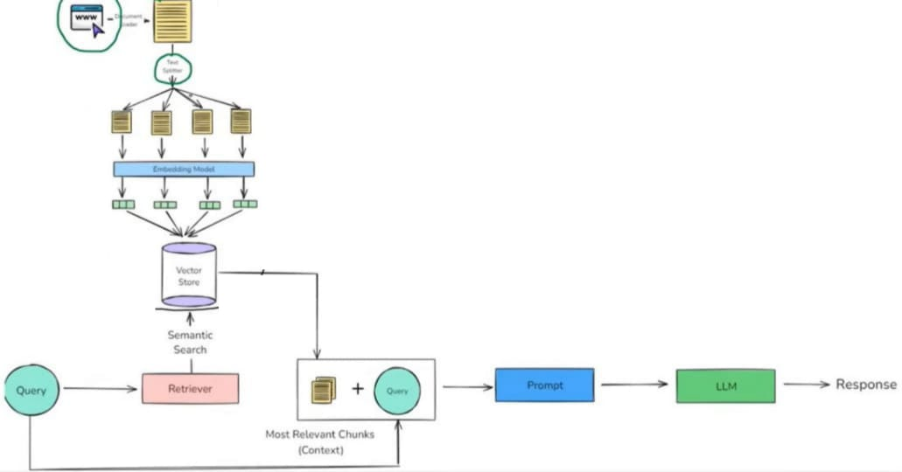

# 19.-YouTube-Chatbot

🧠 Project Overview: 
Today, I built a YouTube Chatbot powered by a complete Retrieval-Augmented Generation (RAG) pipeline. Instead of scrolling through timestamps or replaying videos to find what you need, now you can simply enter the YouTube video URL and start chatting with that specific video — asking it questions and getting precise, context-aware answers.

This project makes video content interactive and intelligent, letting you unlock knowledge without wasting time.

🎯 How It Works
1️⃣ Transcript Loading – Automatically fetches the transcript from the YouTube video.

2️⃣ Chunking – Splits long transcripts into smaller, meaningful sections for context preservation.

3️⃣ Embeddings – Converts chunks into semantic embeddings.

4️⃣ Vector Store – Stores embeddings in a vector database for efficient similarity search.

5️⃣ User Prompt – User enters a question after providing the video URL.

6️⃣ Retrieval – The system finds the most relevant transcript chunks from the vector store.

7️⃣ Answer Generation – Retrieved context is sent to the LLM, which generates a clear, natural-language response.

📈 Impact & Use Cases
🔹 Turn long lectures into interactive Q&A.
🔹 Extract key knowledge from tutorials, interviews, or podcasts.
🔹 Save hours by asking direct questions instead of watching entire videos.

📌 Tech Stack
LangChain | LangGraph | Hugging Face | FAISS (Vector Store) | YouTube Transcript API | Python | NLP | Machine Learning
